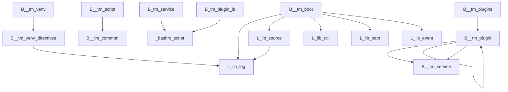

# Tool Manager Project Overview

This document provides a high-level architectural overview of the Tool Manager (`tm`) framework.

## Core Design Philosophy
The Tool Manager is built on a foundation of modularity and delegation. It follows the Unix philosophy where individual scripts are responsible for a single, well-defined task. Complex functionality is achieved by composing these scripts and leveraging a set of powerful, reusable libraries.

## Architectural Components

The codebase is divided into several key areas:

1.  **`bin/` - Core Executable Scripts:**
    *   Contains all the primary, user-facing commands (e.g., `tm-plugin-install`, `tm-service-start`). These are the stable, public-facing tools.

2.  **`lib-shared/` - Shared Libraries:**
    *   Contains the core logic of the framework, organized into reusable Bash libraries (e.g., `lib.plugins.sh`, `lib.cfg.sh`). This is where the main business logic resides.

3.  **`bin-dev/` - Developer Utility Scripts:**
    *   Contains scripts specifically for developing and maintaining the Tool Manager framework itself (e.g., `tm-dev-llm-verify`). These are not for end-users but are stable tools for contributors.

4.  **`bin-experimental/` - Experimental Scripts:**
    *   An area for scripts that are unstable, incomplete, or being tested. The contents of this directory should be ignored for all standard development and usage.

5.  **`bin-internal/` - Internal Scripts:**
    *   Contains stable, internal scripts that are used by other `tm` commands or plugins, but are not intended for direct execution by end-users. This provides a clean, internal API.

## Key Concepts & Interactions

-   **Plugins:** The central concept. Plugins are collections of scripts installed from Git repositories. The `tm-plugin-*` commands manage their entire lifecycle (install, enable, disable, delete). The core logic for this is found in `lib.plugins.sh`.

-   **Services:** A special type of plugin that can be run as a background process. The `tm-service-*` commands manage these, using functions from `lib.service.sh`.

-   **Spaces:** A feature for creating isolated environments or profiles for plugins. This allows for different configurations of the same tool. Logic is handled by `lib.space.sh`.

-   **Configuration:** The framework uses a hierarchical configuration system, managed by `lib.cfg.sh`. This allows for global, per-plugin, and per-space settings.

-   **Execution Flow:** A typical command execution looks like this:
    1.  A user runs a command, e.g., `tm-plugin-ls --enabled`.
    2.  The `bin/tm-plugin-ls` script is executed.
    3.  It uses `lib.args.sh` to parse the `--enabled` flag.
    4.  It calls the `_tm::plugins::find_all_enabled_plugin_ids` function from `lib.plugins.sh`.
    5.  The library function reads the configuration and state files to determine which plugins are enabled.
    6.  The result is returned to the `tm-plugin-ls` script, which then formats and prints the output to the user.

By understanding this separation of concerns—with `bin` scripts as the entry points and `lib-shared` libraries as the logical core—one can effectively navigate and contribute to the codebase.

## Architectural Diagram

